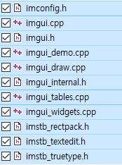
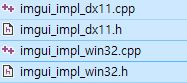

# DX2D TIL
<br>

### 1. 231211
DirectX 초기화 - device, device context 에 대한 DESC 입력 및 인터페이스 할당(참조)/ rtv, swap chain 선언
- [content_diff](https://github.com/VaVamVa/DX2D/commit/24ab2b2bef0dba8af42210bfbd6ef1dfd588eaa5)
    - D2DX.cpp, framework.h
#### 과제
- [DirectX 기본 개념](lesson/D2DX/DX2D_Concepts.md)
- [DirectX 초기화](lesson/D2DX/DX2D_Init.md)

<br>

### 2. 231212
Shader 스크립트 만들기 (Vertex Shader, Pixel Shader) with Rendering Pipeline
- [content_diff](https://github.com/VaVamVa/DX2D/commit/afc45d158c08266274633960fbd010fb9cf9804a)
    - D2DX.cpp
    - Shader Script의 컴파일을 위한 HLSL 컴파일 진입점과 Shader Model version을 정해줘야 함.
        - 수업 pjt의 경우, VS가 첫 함수이므로 VS를 진입점으로 잡고, Shader Model은 DX11에서 version 5.0으로 지정.
- [포프의_쉐이더_입문강좌_1](https://blog.popekim.com/ko/2011/11/29/intro-to-shader-01-what-is-shader-part-1.html)
#### 과제
- [n각형 그리기](lesson/D2DX/DX2D_Polygon.md)
    - [content_diff](https://github.com/VaVamVa/DX2D/commit/d24c9f0f0a10abf64334369e41181b60a2b805aa)

<br>

### 3. 231213
`1`, `2` 내용을 기반으로 Framework 구축하기
- [content_diff](https://github.com/VaVamVa/DX2D/commit/26557ec506220713760249e319f45f8f3f570d5c)
    - project 전체적으로.
- 물방울책 4장~6장
```
Framework/
    - Render [Device, DC, swap chain, rtv]
    - Shader [VS, PS] - 6장 p.211
    - Buffer [Vertex(with Layout), Index, Constant(in Global)]

Manager/ GameManager : set viewport, Alloc Scene

Scenes/ TutorialScene : Alloc&Set Shaders, Alloc&Set Buffers, (indexed line type)Draw

Shaders/ Tutorial.hlsl : structs for Vertex & Pixel , 3 const buffers for wvp transpose
```
    

#### 과제
- [DirectX 렌더링 파이프라인](lesson/DX2DwithFramework/DX2D_Rendering_Pipeline.md)

<br>

### 4. 231214
객체 SRT 구현
- [content_diff](https://github.com/VaVamVa/DX2D/commit/d9b2fc7f7b0142588afba8062d258f70859dbf70)
    - project
```
Framework/
    - Environment : viewport, projection buffer

Scenes/ SRT scene : Alloc&Set object, Alloc&Set world buffer,
    matWorld : for matrix calculate, wolrd matrix for setting world buffer,
    object attributes

Objects for init vertices to vertex buffer&shader (with pixel buffer&shader)
```

1. viewport 생성&설정 및 view buffer, projection buffer 생성&설정을 Environment 객체로 뺌.
    - Framework/Environment
2. SRT scene 를 새로 만듦. world buffer를 이 객체에 선언&할당
    - Scale, Rotation, Translation
3. 별도의 Object 객체로 vertices를 뺌
    - 추후 world buffer도 빼서 객체의 움직임 (SRT) 구현함.

#### 과제
- [Plane](https://github.com/VaVamVa/DX2D/lesson/DX2DwithFramework/DX2DwithFramework/Scenes/PlaneScene.h)
    - [content_diff](https://github.com/VaVamVa/DX2D/commit/f27113ed0ee3f6be64364c921f56baa970dc3b4e)
- [Plane_codu](https://github.com/VaVamVa/DX2D/lesson/DX2DwithFramework/DX2D_SRTmatrix.md)

<br>

### 5. 231215
(Rect->Quad 이름변경)
1. Quad 객체 상위에 Transform 객체를 둚으로서, SRT 행위들을 상위 객체에서 상속,<br> 해당 world 행렬을 이 객체에서 다룸.
2. DirectX Tex 외부 리소스 다운로드

```cpp
--DirectX tex 정적 library 설치 및 적용--
google-DirectX tex 검색- Microsoft github.
Release 프로젝트 중 제일 최신 버전에서 Assets-Source code(zip) 설치.

DirectXTex_Desktop_2022_Win10 solution pjt 열고 빌드하기.

\DirectXTex-oct2023\DirectXTex-oct2023\DirectXTex
에서 DirectXTex.h, DirectXTex.ini 파일 복사하여
내 프로젝트 Libraries 하위에 DirectXTex 폴더 생성 후 붙여넣기.

\DirectXTex-oct2023\DirectXTex-oct2023\DirectXTex\Bin\Desktop_2022_Win10\x64\Debug
에서 lib 파일을 복사하여 내 프로젝트 Libraries/Lib/ 폴더 하위에 붙여넣기

#include "Libraries/DirectXTex/DirectXTex.h"
#pragma comment(lib, "Libraries/lib/DirectXTex.lib")
추가하기
```

3. 외부 resource를 폴리곤으로 잘라 붙이기 위한 새로운 vertex & pixel hlsl 파일 생성
    - float4 color -> float2 uv
    - layout 변경 해줘야함
    - pixel shader가 따로 파일로 만들었기 때문에 이 파일의 진입점 재설정.
4. resource 이용을 위한 Texture 객체 생성 (`srv`, 그대로는 참조 불가능한 `image`)
5. Environment 객체에서 sampler와 blend 인터페이스 이용 추가.

- [content_diff](https://github.com/VaVamVa/DX2D/commit/88020006a3a965ff8e90c44dedd138075e37d5ab)

#### 과제
- [Plane](https://github.com/VaVamVa/DX2D/tree/main/lesson/DX2DwithFramework/DX2DwithFramework)
    - [content_diff](https://github.com/VaVamVa/DX2D/commit/f79c48b92800e9edd16971c85ab86e2e54715c6f)
1. Vertex Shader와 Pixel Shader를 각각 한 종류(?_Shader 방식? hlsl 파일?) 당 1개 씩 생성해 주었음
2. api 때 했던 로직과 유사하게 객체들의 구조를 짰음.
- 빠르게 구현하기 위해 tsv 파일을 썼으나, String parser를 이용하여 csv 파일을 쓸 수 있게 수정 필요.

<br>

### 5. 231219
1. Shader에 대한 static container를 가지는 하나의 super class를 두어 중복 생성 관리 (`4.231215`는 각 Shader 객체에서 관리했음.)
    - [content_diff](https://github.com/VaVamVa/DX2D/commit/8fe456b561b8cef8622fd8e2573ad35178fe1b80)
2. [obj를 한 묶음으로 관리하게 함](https://github.com/VaVamVa/DX2D/blob/main/lesson/231219_Shooting_lesson/D2DX_2309/Objects/Basic/ObjectManager.h)
    - 변경된 점이 많아 수업의 프로젝트를 그대로 가져옴.
    - [content_diff](https://github.com/VaVamVa/DX2D/commit/3841aefdc76516a76f54c063e80bc78a04b7af3b)
    - ObjectManager 에서 depth에 따라 차등 Render
        - container로서 `multimap` 이용. depth를 key로 두어 오름차순으로 후에 Render되도록 설계.
3. background 생성.

<br>
  
### 6. 231220

1. 원형 경기장 설정 및 원형 경기장 밖으로 못 빠져나가게 구현.
   - sliding vector를 구하려고 했으나, 구현에 어려움이 있어 차선책으로 `push land` 이용.
   ```cpp
     /*
    if (distance >= MAP_RADIUS)
    {
        // sliding vector
        velocity = velocity - normalVector * Dot(velocity, normalVector);

        Translate(normalVector * MAP_PUSH_SPEED * DELTA);
    }
    */
    if (distance >= MAP_RADIUS)
    {
        Vector2 normalVector = (CENTER - localPosition).GetNormalized();
        Translate(normalVector * MAP_PUSH_SPEED * DELTA);
    }
     ```
     - [reference](https://toymaker.tistory.com/entry/%EB%AF%B8%EB%81%84%EB%9F%AC%EC%A7%90-%EB%B2%A1%ED%84%B0-Sliding-Vector)

2. Collider 객체 생성, 해당 객체를 충돌이 가능한 객체에 참조.
3. Collider 가능한 범위 표현을 위해 원형의 Line Strip를 Shade 해주기 위해 새로운 `Shader` 생성.
   - [VertexPos](https://github.com/VaVamVa/DX2D/blob/main/lesson/231219_Shooting_lesson/D2DX_2309/Shaders/VertexPos.hlsl), [PixelPos](https://github.com/VaVamVa/DX2D/blob/main/lesson/231219_Shooting_lesson/D2DX_2309/Shaders/PixelPos.hlsl) Shader 생성.
   - 이때 `PixelPos Shader`에 Color를 전달해 줄 ConstBuffer를 상속받는 Color Buffer 생성.
4. `3`을 기반으로 plane, enemy, bullet 객체 collider 참조하여 collision 구현.(과제)
   - [content_diff](https://github.com/VaVamVa/DX2D/commit/49f5dcf1a26a5019a688d09d0fbb70a3f9c3412a)

- [content_diff](https://github.com/VaVamVa/DX2D/commit/845c5b034b6724783dc046b8bbbf4b4d694c7d6a)

<br>
  
### 7. 231221
<br>

#### ShootingScene

1. 새로운 [PxielBGLightShader](./lesson/231219_Shooting_lesson/D2DX_2309/Shaders/PixelBGLight.hlsl) 생성.
    - Texture와 색상을 곱하여 Shade 함.
    - shader를 angle에 따라 rotate 해줌 (회전 행렬)

2. `bg2` Texture를 따로 생성해준 후, 이를 `1`의 새로운 PixelShader에 적용. `PSSet(1)`

#### CollisionScene

1. `imgui` 적용.

#### `imgui` library 적용법

1. 솔루션 우클릭->새 프로젝트-> "정적 라이브러리" 추가, 원래 있던 소스, 헤더파일 삭제
2. `imgui` 최신버전 다운로드 후 아래의 파일들 솔루션에 복사 & 붙여넣기, 프로젝트에 포함
    - `imgui-version/imgui-version`
    
    - `imgui-version/imgui-version/backends`
    
3. `ImGui` 솔루션에서 미리 컴파일된 헤더 사용하지 않음 한 후 빌드
4. `pjt/x64/Debug` 생성된 `본인이 만든 정적 라이브러리 솔루션 이름.lib`(`ImGui`) 파일을 본인 프로젝트의 `Libraries`에 붙여넣기
5. `pjt/Libraries`에 `ImGui` 폴더 생성 후, 정적 라이브러리 솔루션에 존재하는 모든 Header 파일 복사 & 붙여넣기, 프로젝트에 포함
    - (+) 유형별로 정리하면 헤더파일만 모을 수 있음.
6. 정적 라이브러리 (생성용) 솔루션 제거(&삭제)
7. `Framework.h` 에서 필요한 헤더파일들 포함시키고, 그 구현부를 `4`의 정적 라이브러리와 연결
```
#include "Libraries/ImGui/" + (imgui.h, imgui_impl_dx11.h, imgui_impl_win32.h)
#pragma comment(lib, "Libraries/Lib/ImGui.lib")
```

8. `main.cpp` 에서 `WinProc` 함수 위에 정적 라이브러리의 전역변수 가져오기
```cpp
extern IMGUI_IMPL_API LRESULT ImGui_ImplWin32_WndProcHandler(HWND hWnd, UINT msg, WPARAM wParam, LPARAM lParam);
```

9. `WinProc` 함수에서 `ImGui` 수행용 함수 호출
```cpp
if (ImGui_ImplWin32_WndProcHandler(hWnd, message, wParam, lParam))
        return true;
```

10. `GameManager` 생성자에서 아래의 코드 입력
```cpp
ImGui::CreateContext();
ImGui::StyleColorsDark();

ImGui_ImplWin32_Init(hWnd);
ImGui_ImplDX11_Init(DEVICE, DC);
```

11. `GameManager` 소멸자에서 아래의 코드 입력
```cpp
ImGui_ImplDX11_Shutdown();
ImGui_ImplWin32_Shutdown();

ImGui::DestroyContext();
```

12. `GameManager::Render()`에서 `scene Render` 이후, `scene PostRender` 이전에 아래의 코드 입력
```cpp
ImGui_ImplDX11_NewFrame();
ImGui_ImplWin32_NewFrame();
    
ImGui::NewFrame();
```

13. `GameManager::Render()`에서 `scene PostRender` 이후에 아래의 코드 입력
```cpp
ImGui::Render();
ImGui_ImplDX11_RenderDrawData(ImGui::GetDrawData());
```

- (+) FPS 를 ImGui 컴포넌트에 띄우는 법.
    - `GameManager::Render()` 에서 `scene PostRender` 직전에.
```cpp
string fps = "FPS : " + to_string(Timer::Get()->GetFPS());
ImGui::Text(fps.c_str());
```

- 기능 : 디버깅, 에디터 등

2. `Vector2`와 행렬을 계산해 주기 위한 연산자 오버로딩 구현
    - [Vector2](https://github.com/VaVamVa/DX2D/blob/main/lesson/231219_Shooting_lesson/D2DX_2309/Framework/Math/Vector2.h)

3. 회전한 네모 객체 `Point Collision` 구현.
    - 회전한 상태는 world buffer에 의한것.
    - 이에 역행렬을 구해 곱해주면 (0,0) 위치 회전하기 전 사각형 객체로 되돌릴 수 있음
    - 똑같이 `Point`도 이 역행렬을 곱해주고, 판단.
- [content_diff]()
